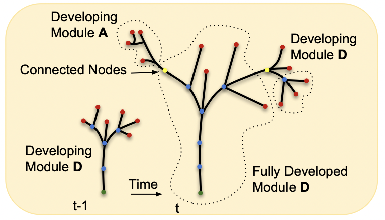
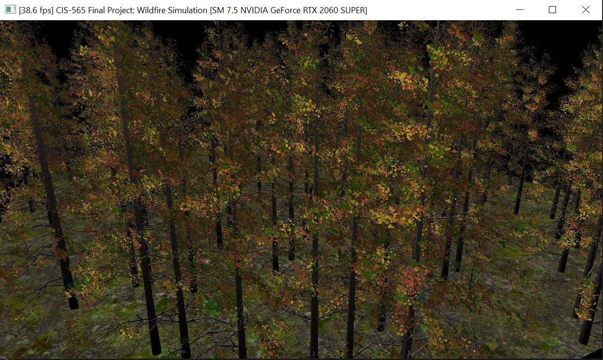
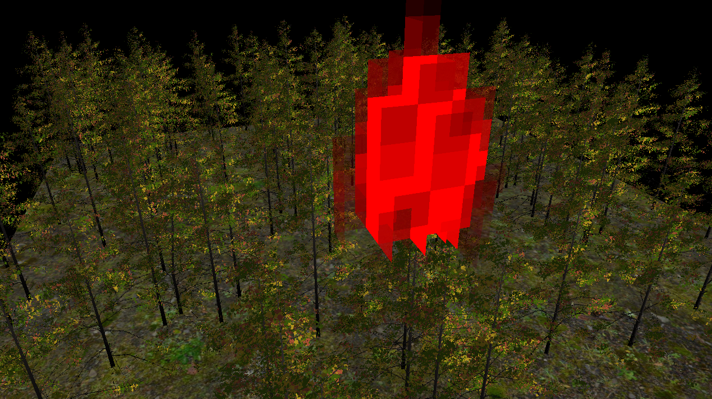
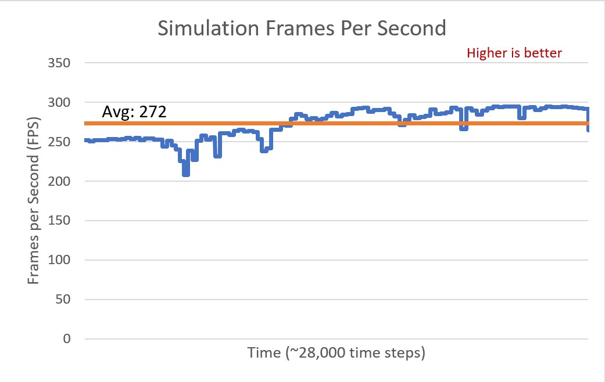

# Wildfire Simulation and Rendering
Adapted from: [Fire in Paradise: Mesoscale Simulation of Wildfires](http://computationalsciences.org/publications/haedrich-2021-wildfires/haedrich-2021-wildfires.pdf)

By [Anthony Mansur](https://www.linkedin.com/in/anthony-mansur-ab3719125/), [Stephen Lee](https://www.linkedin.com/in/stephen-lee-bb5a40163/), and [Lindsay Smith](https://www.linkedin.com/in/lindsay-j-smith/)

See demo: https://drive.google.com/file/d/1S8Z60ukH0U_2dzlXw6enQBMx_5SxaNzJ/view?ts=61b792e6 

## Introduction
As climate change continues to globally exacerbate droughts in dry places, medium to large scale wildfires have become common place during the hottest months of the year. Consequently learning how to predict the spread of wildfires to figure out the best ways to combat them has become increasingly important. 

Physically-based models of wildfires have traditionally been inadequate in accurately simulating real-world behavior due to high computation costs leading to necessary compromises in fidelity. Recently, new [physically-based models](http://computationalsciences.org/publications/haedrich-2021-wildfires/haedrich-2021-wildfires.pdf) have been developed that show promising potential to have a physically-accurate, interactable wildire simulation. This is done by abstracting the trees in a forest into modules that simplify computations while maintaining the geometric and spatial information necessary in maintaining an accurate simulation of fire spread. 

Our goal for this project was to build off of [this work](http://computationalsciences.org/publications/haedrich-2021-wildfires.html), creating a wildfire simulation of our own using C++/CUDA to leverage parallelization on the GPU and OpenGL to render our scenes.

## Forest Representation

  

Image credit: Makowski et al.

The combustion model used in this implementation is defined for individual branch modules, where each tree is defined as a collection of branch modules. These modules come from a [multi-scale method](https://dl.acm.org/doi/pdf/10.1145/3306346.3323039) to design large-scale ecosystems, in which they locally adapt as a result of their development and interaction with neighboring plants. 

### Tree Modeling

The branches that form a tree are represented as truncate cones, with both a starting and an ending radius, and a specified length. Given this information, and the wood's density, we can define the lateral surface area, the volume, and the mass of a given branch. A module, in turn, is composed of a set of adjacent truncated cones, and a tree is defined as a set of connected modules. A forest is then defined as a set of trees.

The way that this forest is represented for the simulation is through a set of buffers: nodes, edges, modules, and module edges. Through these buffers, we can both iterate over every module for simulation, allowing us to extract all the branches that form that module, and over every branch for rendering purposes.

### Module-Level Combustion

The simulation begins by iterating over all the modules in the forest. For every module:

1. Update its mass if combusting based on its temperature
2. Perform radii update for each branch based on its mass loss.
3. Update the temperature based on ambient temeprature and adjacent modules
4. Update the released water content based on the mass loss.
5. Cull from the simulation if mass is zero.

For the scene that we loaded, it took about **33 hours** to fully combust the forest (28,000 timesteps, each being 16 milliseconds).

## Translating to the Grid and Simulation Space
Having implemented combustion at a module-level, the next step is to contextualize that combustion within the environment that that the modules exist. To do this, we have divided the simulation space into a grid of uniform cubes that are used to compute parameters necessary to model the spread of fire throughout the simulation as the fluid air advects and diffuses heat across the scene. We've summarized these computations that we make at a grid-level in the dependency graph below:

  

At a high-level, we have discretized our simulation space into smaller quantities that we can use to approximate the flow of air, heat, and smoke throughout the scene, taking a Eulerian approach as opposed to a particle-based one. We can then map these smaller subsections of our simulation space to our modules by computing their center of mass and finding which grid cell contains it. This enables us to send necessary information between the modules and the grid cells that they exist within thoughout the lifetime of our simulation. We implemented kernels in CUDA to compute these quantities at each time step of our simulation, and we store them in buffers to render aspects of our scene such as smoke and fire, as well as send information back to the modules to compute combustion rate in the next time step.

## Rendering
Thank you Torsten Hädrich and your team for providing us with the forest scene files used in our simulation.
### Branches and Leaves
In order to render our branches we maintained a series of points corresponding to the beginning and end positions of each branch. The points are stored as vec4's, with the fourth component corresponding to the branch radius at that point. We use this method because it gives us all of the information we need in order to render a branch. With this series of points being passed into our shader pipeline we are then able to find the axis from one point to another, as well as the perpendicular vector to render the top and bottom of the branch. The branches are rendering as cylinders, or truncated cones, and are formed using triangle strips. This gives us the series of cylindrical branches that you see in the render. As the branches burn and lose mass, the radius component of the vec4's gets updated, and our branches become smaller.

We also pass another vector into our shader pipeline that indicates whether there are leaves on a given branch. If a branch has leaves we generate a certain amount of randomness in the direction, length, color, and orientation of the leaves. This gives us a more realistic looking render with a wide variety of leaves. 

### Smoke and Fire
To render our smoke and fire, we compute the a color and transparency value for each grid of our simulation and render square faces using those values. The contribution due to smoke is computed using a ray-marching approach, where we first march rays from a light source through the grid to compute radiance values for each grid cell. We then do a second pass where we cast rays from the camera to accumlate these radiance values to shade our grid cells. We then add in a fire contribution term that linearly adds red to the grid cell based on the grid cell's temperature. Here's a sample image of what this looks like in our simulation:

## Performance Analysis

Our simulation with a scene with 25,589 modules (see appendix) took on average 272 fps to run. As we can see by the diagram below, as trees were combusted and culled from the simulation, we noticed a slight increase in our frames per second. 

  

For the larger scene with 204,690 modules, our frames per second was around 30 fps. This shows that a scene with about 10 times as many modules will take about 10 times longer to render a frame. I.e., our performance is directly tied to the number of modules in our forest.

*Tested on: Windows 10, AMD Ryzen 5 3600, Geforce RTX 2060 Super (personal)*

## References

* [Base code](https://github.com/art049/InteractiveWoodCombustion) for fluid solver by Pirk et al.
* [Fire in Paradise: Mesoscale Simulation of Wildfires](http://computationalsciences.org/publications/haedrich-2021-wildfires/haedrich-2021-wildfires.pdf)
* [Synthetic Silviculture: Multi-scale Modeling of Plant Ecosystems](https://dl.acm.org/doi/pdf/10.1145/3306346.3323039)
* [Accelerating large graphs algorithms on the GPU using CUDA](https://citeseerx.ist.psu.edu/viewdoc/download?doi=10.1.1.102.4206&rep=rep1&type=pdf)

 

## Appendix

Below we expand on the specific features we implemented to get the simulation working.  

### Graph Representation

Our entire forest is stored in four buffers we store and send over to GPU. The four types of buffers we have are listed below:

#### Buffer Types

- Module
  - Parameters
    - Temperature
    - Mass, deltaM
    - Bounding box (minPos, maxPos)
    - Lateral Surface Area (before combustion)
    - Module Constant (used for radii update)
    - Water Content
  - Pointers
    - Start and end indices for module edges
    - Start and end indices for nodes
    - Index of the terminal node of the previous module
    - Start and end indices of edges
- Module Edge (Module's adjacency list)
  - Index of module
- Node
  - Parameters
    - Starting radius of the branch
    - Location in space of the node
  - Pointers
    - The previous edge
    - Start and end indices of edges that contain this node
- Edge (Branches)
  - Parameters
    - Length of the edge
    - Radii ratio (equals to end radius divided by start radius)
    - Direction
  - Pointers
    - From and To Node that this edge represents

#### Structure of the buffers used

The information stored in each buffer is ordered in a similar manner as in an adjacency list. It was inspired by this [paper](https://citeseerx.ist.psu.edu/viewdoc/download?doi=10.1.1.102.4206&rep=rep1&type=pdf). Many of the complexites of storing graphs on the GPU were simplified given that we are working with directed tree graphs. Therefore, the majority of the complexity is within the node and edge buffers, so we will elaborate on how these are stored. 

All the nodes and edges that are associated within one module are stored sequentially, so that when iterating by each module, all the information needed for our algorithm will be stored within one uninterrupted sequence of elements in each buffer. That is how we are able to achieve parallelism. Likewise, every edge that a node is contained in is stored sequentially. 

#### Culling

To cull modules that have been burned away, we do not remove them from the four intial buffers. This will require a lot of extra computations. Instead, we keep track of all the active modules in a int buffer, and perform stream compaction for every module that is removed. So, although all the data is still there, we do not launch threads for modules that have already been culled.

### Scene Parser

To run the simulation, we used two scenes given to use by the researchers of the primary paper we referenced. The details of the scenes are described below:

- Scene 1
  - Num. of trees: 269
  - Num. of modules: 25,589
  - Num. of branches: 192,085
  - Ecosystem Size: 50 by 50
- Scene 2
  - Num. of trees: 3,102
  - Num. of modules: 204,690
  - Num. of branches: 1,784,435
  - Ecosystem Size: 200 by 50

A custom file parser was created that reads through every vertex in the scene and adds them to the four buffers in our forest (see above for more details on the buffers used).

The parameters we extract from every vertex in this file is as follows:

- Tree ID
- Module ID
- Parent module ID
- Position in space (x,y,z)
- Radius
- Leaf boolean
