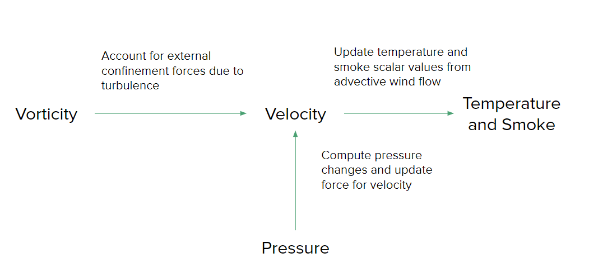

# CIS565-Final-Project
Final Group Project for CIS 565: GPU Programming

by [Anthony Mansur](), [Stephen Lee](), and [Lindsay Smith]()

## Project Overview
Adapted from: [Fire in Paradise: Mesoscale Simulation of Wildfires](http://computationalsciences.org/publications/haedrich-2021-wildfires/haedrich-2021-wildfires.pdf)

## Introduction

As climate change continues to globally exacerbate droughts in dry places, medium to large scale wildfires have become common place during the hottest months of the year. Consequently learning how to predict the spread of wildfires to figure out the best ways to combat them has become increasingly important. 

Physically-based models of wildfires have traditionally been inadequate in accurately simulating real-world behavior due to high computation costs leading to necessary compromises in fidelity. Recently, new [physically-based models](http://computationalsciences.org/publications/haedrich-2021-wildfires/haedrich-2021-wildfires.pdf) have been developed that show promising potential to have a physically-accurate, interactable wildire simulation. This is done by abstracting the trees in a forest into modules that simplify computations while maintaining the geometric and spatial information necessary in maintaining an accurate simulation of fire spread. 

Our goal for this project was to build off of [this work](http://computationalsciences.org/publications/haedrich-2021-wildfires.html) done, creating a wildfire simulation of our own using C++/CUDA to leverage parallelization on the GPU and OpenGL to render our scenes.

## Module-Based Approach

## Translating to the Grid and Simulation Space
Having implemented combustion at a module-level, the next step is to contextualize that combustion within the environment that that the modules exist. To do this, we have divided the simulation space into a grid of uniform cubes that are used to compute parameters necessary to model the spread of fire throughout the simulation as the fluid air advects and diffuses heat across the scene. We've summarized these computations that we make at a grid-level in the dependency graph below:

At a high-level, we have discretized our simulation space into smaller quantities that we can use to approximate the flow of air, heat, and smoke throughout the scene, taking a Eulerian approach as opposed to a particle-based one. We can then map these smaller subsections of our simulation space to our modules by computing their center of mass and finding which grid cell contains it. This enables us to send necessary information between the modules and the grid cells that they exist within thoughout the lifetime of our simulation. We implemented kernels in CUDA to compute these quantities at each time step of our simulation, and we store them in buffers to render aspects of our scene such as smoke and fire, as well as send information back to the modules to compute combustion rate in the next time step.

## Rendering
Thank you to Torsten Hädrich, Daniel T. Banuti, Wojtek Pałubicki, Sören Pirk, and Dominik L. Michels for providing us with the forest scene files loaded and rendered in our scenes.
### Branches and Leaves
### Smoke and Fire
## References
* Base code for [fluid solver](https://github.com/art049/InteractiveWoodCombustion) by Pirk et al.